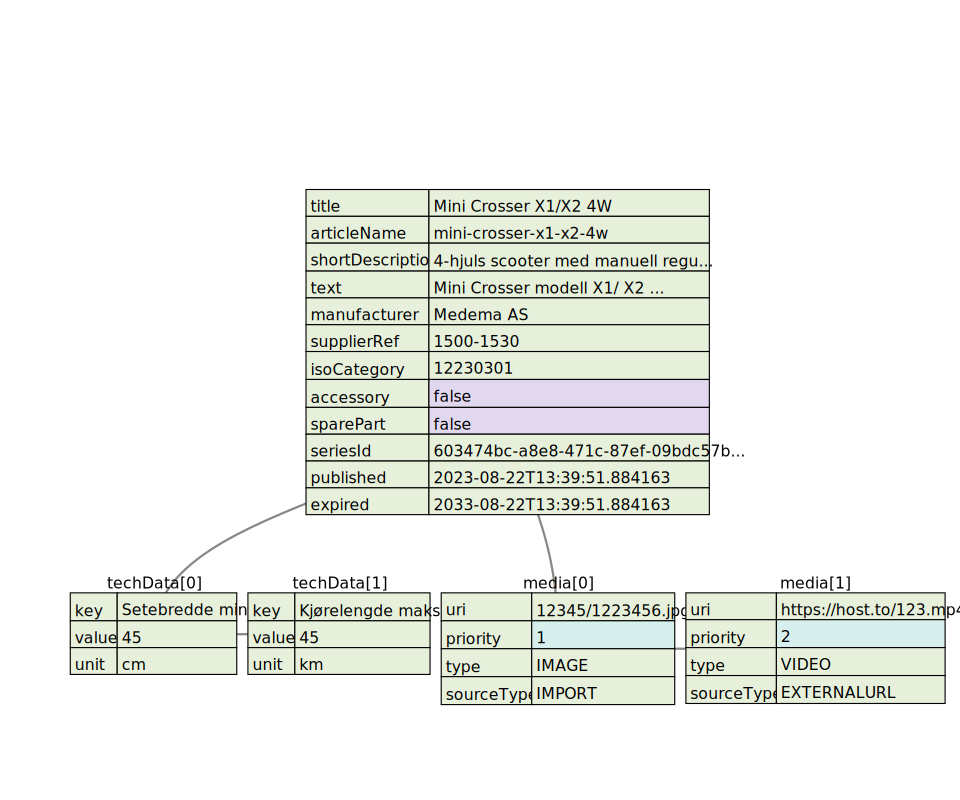

# NAV Assistive devices API

## Introduction
Vendors can use this API to upload and publish assistive devices to 
[finnhjelpemidler.nav.no](https://finnhjelpemidler.nav.no).
Finnhjelpemidler is a public site provided by NAV (Norwegian Labour and Welfare Administration), 
a place where you can search for, find information, and apply for assistive devices.

### Features of the API:
* Create new, change and deactivate products, accessories and spare parts
* Connect product variants to series
* Linking accessories and spare parts to main products
* Upload media or documents (images, pdf, video)
* Know the state of each product
* Get Hms number of the product
* Information about [framework agreements](https://finnhelpemidler-api.nav.no/import/api/v1/agreements) (rammeavtale)
* Download [Iso categories](https://finnhjelpemidler-api.nav.no/import/api/v1/isocategories) and [techdata labels](https://finnhjelpemidler-api.nav.no/import/api/v1/techlabels)

### Registration
Before you begin, you must register yourself as a vendor/supplier. Please email us
with the following information:

* Company name
* Contact email
* Contact Phone

We will send you your supplier identity including a secret key that gives you access to our API

### Authentication/Authorization
The API is not publicly open, all requests need to be authenticated using
the HTTP bearer authorization header.

Example:
```
POST https://finnhjelpemidler-api.nav.no/import/api/v1/products/transfers/{supplierId}
Accept: application/x-json-stream
Cache-Control: no-cache
Content-Type: application/x-json-stream
Authorization: Bearer <your secret key>
```

# Rest API

The API is designed as a lightweight REST API supporting HTTP standard requests with JSON as payload. 
Each request will return receipts in JSON format, with a http status code and a body with the result.
If ERROR was detected, the body will contain the error message.

### OpenAPI
To test the integration, you can use the OpenAPI specification,
it is available [here in test](https://finnhjelpemidler-api.ekstern.dev.nav.no/import/swagger-ui/), and in
[prod](https://finnhjelpemidler-api.nav.no/import/swagger-ui/).

The data exchange format is JSON, below is a diagram of the product json structure:

You can also download kotlin code for the DTOs
[here](https://github.com/navikt/hm-grunndata-import/blob/master/src/main/kotlin/no/nav/hm/grunndata/importapi/transfer/)

### Json properties

| Name             | Type         | Required | Norwegian translation         | Description                                                                                                                       | Example                              |
|:-----------------|:-------------|:---------|:------------------------------|:----------------------------------------------------------------------------------------------------------------------------------|:-------------------------------------|
| Title            | String (255) | Yes      | Tittel                        | Title or name of the product, product variants that are connected in a series will have this as the series title                  | Mini crosser X1                      |
| articleName      | String (255) | Yes      | Artikkel Navn                 | The name or title of the article                                                                                                  | Mini crosser x1 4w                   |
| shortDescription | TEXT         | Yes      | Kort beskrivelse              | A short summary text                                                                                                              | A short summary text                 |
| text             | TEXT         | Yes      | Produkt beskrivelse           | A describing text, html must be welformed. We only support basic html tags                                                        | A describing text                    |
| manufacturer     | String (255) | No       | Produsent                     | The name of the company who made this product                                                                                     | Medema                               |
| supplierRef      | String (255) | Yes      | Leverandør artikkel referanse | A unique reference to identify the product                                                                                        | alphanumber eg: A4231F-132           |
 | isoCategory      | String (255) | Yes      | ISO Kategori                  | The ISO category for the product, categories can be found [here](https://finnhjelpemidler-api.nav.no/import/api/v1/isocategories) | 12230301                             |
| accessory        | Boolean      | Yes      | Tilbehør                      | Is this product an accessory?                                                                                                     | true                                 |
| sparePart        | Boolean      | Yes      | Reservedel                    | Is this product a spare part?                                                                                                     | false                                |
| seriesId         | UUID         | No       | Serie ID                      | A unique id for a series of products, this id linked the products into a series                                                   | 603474bc-a8e8-471c-87ef-09bdc57bea59 |
| techData         | List         | No       | Tekniske data                 | A list of technical data for the product                                                                                          | see techdata table below             |
| media            | List         | No       | Media                         | A list of media files for the product                                                                                             | see media table below                |
| published        | Date         | No       | Publisert                     | The date when the product should be published                                                                                     | 2023-08-22T13:39:51.884163           |
| expired          | Date         | No       | Utløpsdato                    | The date when the product expires                                                                                                 | 2033-08-22T13:39:51.884163           |
| compatibleWith   | Object       | No       | Kompatibel med/passer til     | A list of seriesId that this accessory/spare part is compatible with                                                              | example below                        |
| status           | String (255) | No       | Status                        | The status of the product                                                                                                         | ACTIVE, INACTIVE, DELETED            |
| url              | String (255) | No       | URL                           | A link to the product on the vendors website                                                                                      | https://www.blimo.no/elekriske-kjoretoy/elscootere/blimo-gatsby-x              |

### Techdata
Valid techdata labels with keys and units is listed [here](https://finnhjelpemidler-api.nav.no/import/api/v1/techlabels)
Even thought it is optional to add techdata, it is recommended to add as much as possible to make it easier for the user to compare products.
Also some products in framework agreements requires techdata to be added, if data is missing or wrong the product will be rejected.

| Name  | Type         | Required | Norwegian translation | Description | Example |
|:------|:-------------|:---------|:----------------------|:------------|:--------|
| key   | String (255) | Yes      | Nøkkel                | The name of the technical data | Setebredde min |
| value | String (255) | Yes      | Verdi                 | The value of the technical data | 45 |
| unit  | String (255) | No       | Enhet                 | The unit of the technical data | cm |


### Media

| Name       | Type         | Required | Norwegian translation | Description                                                       | Example                                                |
|:-----------|:-------------|:---------|:----------------------|:------------------------------------------------------------------|:-------------------------------------------------------|
| uri        | String (255) | Yes      | URI                   | The uri to the media file                                         | imort/12345/1223456.jpg or https://youtube.com/myvideo |
| priority   | Integer      | Yes      | Prioritet             | The priority of the media file, 1 will always be the main picture | 1                                                      |
| type       | String (255) | Yes      | Type                  | The type of the media file                                        | IMAGE, PDF, VIDEO                                      |
| text       | TEXT         | Yes      | Tekst                 | A describing text for the media file                              | Main picture showing the standard configuration        |
| sourceType | String (255) | Yes      | Kilde                 | The source of the media file                                      | IMPORT, EXTERNALURL                                    |


More info about Media and how to upload media files below.

### Posting a Product using stream
Post products in stream by using Content-Type: application/x-json-stream. products are separated by a newline "\n" for
example:

```
POST https://finnhjelpemidler-api.nav.no/import/api/v1/products/transfers/{supplierId}
Accept: application/x-json-stream
Cache-Control: no-cache
Content-Type: application/x-json-stream
Authorization: Bearer <your secret key>
{
  "title": "Blimo Gatsby X",
  "articleName": "Blimo Gatsby X",
  "shortDescription": "Modellen har et praktisk og pedagogiskt utformet digitalt kontrollpanel der føreren enkelt ser hvor mye batteri som er igjen, hastighet, klokke m.m. Her finnes det mulighet å raskt stille ned motorstyrken for lavere fart i trange miljøer. Regulering finnes også for belysning og blinkers, som samtlige har energisnåle LED-lamper",
  "text": "Det er enkelt å kjøre en atsby: Gasse gjør du gjennom å trykke ned høyre gasshåndtak og bremse gjør du gjennom å slippe det. Når kjøretøyet har stoppet aktiveres en automatisk parkeringsbremse. For å rygge gjør du motsvarende, men med venster sides gasshåndtak.<br/><br/><br/>Modellen har et praktisk og pedagogiskt utformet digitalt kontrollpanel der føreren enkelt ser hvor mye batteri som er igjen, hastighet, klokke m.m. Her finnes det mulighet å raskt stille ned motorstyrken for lavere fart i trange miljøer. Regulering finnes også for belysning og blinkers, som samtlige har energisnåle LED-lamper.<br/><br/><br/>Setet er av riktig komfortmodell på Blimo Gatsby der du har en stor sitteyte, høy ryggstøtte med nakkestøtte samt justerbare armlen. Det går å stille inn setet i høyden samt skyve den i lengden. Også styret kan justeres slik ar alle førere skal finne en ergonomisk sittestilling. Setet kan vinkles til begge sider for å enkelt gå inn og ut av kjøretøyet.",
  "supplierRef": "99521146",
  "isoCategory": "12230303",
  "published": "2023-08-08T12:09:19.135969841",
  "expired": "2033-08-08T12:09:19.13597404",
  "accessory": false,
  "sparePart": false,
  "url": "https://www.blimo.no/elekriske-kjoretoy/elscootere/blimo-gatsby-x",
  "techData": [
    {
      "key": "Hastighet maks",
      "value": "15",
      "unit": "km/t"
    },
    {
      "key": "Motorstyrke",
      "value": "950",
      "unit": "watt"
    },
    {
      "key": "Totallengde",
      "value": "155",
      "unit": "cm"
    },
    {
      "key": "Totalbredde",
      "value": "65",
      "unit": "cm"
    },
    {
      "key": "Vekt inkl batteri",
      "value": "150",
      "unit": "kg"
    },
    {
      "key": "Kjørelengde maks",
      "value": "48",
      "unit": "km"
    },
    {
      "key": "Brukervekt maks",
      "value": "150",
      "unit": "kg"
    }
  ],
  "media": [
    {
      "uri": "import/9c68e99a-a730-4048-ad2c-2ba8ff466b8f/fee69db9-96d2-43d1-947b-b711809cd717.jpg",
      "priority": 1,
      "type": "IMAGE",
      "text": "Blimo gatsby x i rød farge"
    },
    {
      "uri": "import/9c68e99a-a730-4048-ad2c-2ba8ff466b8f/5a4951fc-7cab-43ea-ad9a-1b93c23e7d95.jpg",
      "priority": 2,
      "type": "IMAGE",
      "text": "Blimo gatsby x i grønn farge"
    },
    {
      "uri": "import/9c68e99a-a730-4048-ad2c-2ba8ff466b8f/12e9dee7-d4c3-4fb4-b9de-5bc6eb347b4d.jpg",
      "priority": 3,
      "type": "IMAGE",
      "text": "Blimo gatsby x i svart farge"
    }
  ]
}

. 
.
.
```

You will continuously get receipt for each product like this:

```
HTTP/1.1 200 OK
transfer-encoding: chunked
Date: Fri, 3 Apr 2020 10:37:07 GMT
transfer-encoding: chunked
content-type: application/x-json-stream

{
  "versionId" : 1,
  "status" : "RECEIVED",
  "md5" : "3D5A0C23BC12D58D5865CF3CFC086F11",
  "items" : 1,
  "created" : "2020-04-03T12:37:07.83019",
  "updated" : "2020-04-03T12:37:07.830203"
}{
  "versionId" : 2,
  "status" : "RECEIVED",
  "md5" : "CA41CC694F62E14F72FDE43B66C9821B",
  "items" : 1,
  "created" : "2020-04-03T12:37:07.861917",
  "updated" : "2020-04-03T12:37:07.861923"
}
```

It is important to check the status for each receipt, if it is not "ERROR".
When using stream, the http status code will always return 200 OK. 

## Media upload (Image, PDF)
Media files are uploaded using multipart/form-data. 
The media files are first uploaded before they can be used in a product. 
There is support for uploading multiple files in one request. But the maximum size is 10MB for each upload.

### External media (video)
It is possible to link to external media, for example a video on youtube.
The media file will not be uploaded to NAV's servers, but will be linked to the product and displayed externally.

### Linking media files to product
When uploading media files, you will get a receipt for each file. The receipt contains a unique uri that can be used 
on the product json. 

### Upload image
```
POST https://finnhjelpemidler-api.nav.no/import/api/v1/media/transfers/files/{supplierId}/{supplierRef}
Accept: application/json
Content-Type: multipart/form-data
Authorization: Bearer <your secret key>
Files=@filename.jpg;type=image/jpeg
```
You will get a receipt like this:
```
[  
  {
    "transferId": "e5fa2fd0-1e9a-4095-9b33-35431901dc8f",
    "supplierRef": "99521146",
    "supplierId": "f639825c-2fc6-49cd-82ae-31b8ffa449a6",
    "md5": "f20912b65f5e2b4460652e53b89af091",
    "filesize": 1057306,
    "filename": "filename.jpg",
    "sourceUri": "http://localhost:8081/local/import/9c68e99a-a730-4048-ad2c-2ba8ff466b8f/6db81c58-7d3b-4c42-9c58-fd01497d75d8.jpg",
    "uri": "import/9c68e99a-a730-4048-ad2c-2ba8ff466b8f/6db81c58-7d3b-4c42-9c58-fd01497d75d8.jpg",
    "transferStatus": "DONE",
    "created": "2023-10-24T10:08:17.35855",
    "updated": "2023-10-24T10:08:17.358555"
  }
]
```
Then linking the uri to the product json within the media array:
```
  "media" : [ {
    "uri" : "import/9c68e99a-a730-4048-ad2c-2ba8ff466b8f/6db81c58-7d3b-4c42-9c58-fd01497d75d8.jpg",
    "priority" : 1,
    "type" : "IMAGE",
    "text" : "Main picture showing the standard configuration"
    "sourceType": "IMPORT"
    },
    {
      "uri": "https://youtube.com/123.mp4",
      "priority": 2,
      "type": "VIDEO",
      "text": "Video showing the product"
      "sourceType": "EXTERNALURL"
    }
  ],

```

### Media limitations
* Maximum file size is 10MB
* Only jpg, png and pdf files are supported
* You can not link more than 10 media files per product

## Series of products
A series of products is a group of products that are similar, but have different variants. 
To group the variants to a series, you have to create a series first.
Then you can upload the variants and link them to the series by using the seriesId.

### Posting a series
```
POST https://finnhjelpemidler-api.nav.no/import/api/v1/product/series/{supplierId}
Accept: application/json
Content-Type: application/json
Cache-Control: no-cache
Authorization: Bearer <your secret key>
{
  "seriesId": "603474bc-a8e8-471c-87ef-09bdc57bea59",
  "title": "Mini Crosser",
  "status": "ACTIVE"
}
```

| Name    | Type         | Required | Norwegian translation | Description                                                                                                     | Example                              |
|:--------|:-------------|:---------|:----------------------|:----------------------------------------------------------------------------------------------------------------|:-------------------------------------|
| seriesId| UUID         | No       | Serie ID              | A unique id for a series of products, this id linked the products into a series                                 | 603474bc-a8e8-471c-87ef-09bdc57bea59 |
| title   | String (255) | Yes      | Serie tittel          | Title or name of the series, product variants that are connected in a series will have this as the series title | Mini crosser X1                      |
| status  | String (255) | Yes      | Status                | The status of the series, ACTIVE or INACTIVE                                                                    | ACTIVE, INACTIVE                     |

### Posting a product variant of a series
Posting a variant is exactly the same as product, and use seriesId to tell which series the variant belongs to.

```
POST https://finnhjelpemidler-api.nav.no/import/api/v1/products/transfers/{supplierId}
Accept: application/x-json-stream
Cache-Control: no-cache
Content-Type: application/x-json-stream
Authorization: Bearer <your secret key>
{
  "title": "Mini Crosser X1/X2 4W",
  "articleName" : "mini-crosser-x1-x2-4w",
  "shortDescription" : "4-hjuls scooter med manuell regulering av seteløft, ryggvinkel og seterotasjon. Leveres som standard med Ergo2 sitteenhet.",
  "text" : "Mini Crosser modell X1/ X2\n Er uten sammenligning markedets sterkeste og mest komfortable el scooter: Her får man både stor motorkraft, mulighet for ekstra stor kjørelengde og unik regulerbar fjæring pakket inn i et usedvanlig lekkert design. Nordens mest solgte scooter er spesielt konstruert for nordisk klima og geografi, hvilket betyr at den er velegnet for bruk året rundt, på dårlige veier, snøføre, og ellers hvor man ønsker ekstra stabilitet. Det er virkelig fokusert på sikkerheten, og uten at det går på kompromiss med bruksegenskaper og design. Leveres også med kabin.\n                    Hjul , fjæring og styre Mini Crosser har behagelig fjæring på alle 4 hjul, inklusive justerbare støtdempere på alle hjul. Vi har stort utvalg av ulike hjul, inklusive pigghjul. Det multijusterbare styret sikrer optimal komfort. Det er utstyrt med et kardan-ledd og kan heves, senkes og vinkles. Krever kun liten armstyrke ved kjøring. Kurv blir stående stille når man svinger. Markedets minste svingradius!\n                    Luksussete er standard. For å gi den ideelle sittestilling kan Mini Crosser Ergo-sete justeres i høyde, dybde og ryggvinkel og leveres i størrelser fra 35 til 70cm og med ulike rygghøyder. Armlenene er både høyde- og dybdejusterbare, samt oppfellbare og kan utstyres med ulike armlenspolstre. Setet er videre utstyrt med glideskinne og kan dreies 90 grader til begge sider. Det store sortimentet av seter, sete- og ryggputer og el funksjoner muliggjør nærmest enhver ønsket setetilpasning – muligheter man ellers kun finner på de mest avanserte el-rullestoler!",
  "manufacturer" : "Medema AS",
  "supplierRef" : "1500-1530",
  "isoCategory" : "12230301",
  "accessory" : false,
  "sparePart" : false,
  "seriesId": "603474bc-a8e8-471c-87ef-09bdc57bea59", <--- This is the seriesId, that was created in the previous step
  "techData" : [ {
    "key" : "Setebredde min",
    "value" : "45",
    "unit" : "cm"
  }, {
    "key" : "Kjørelengde maks",
    "value" : "45",
    "unit" : "km"
  } ],
  "media" : [ {
    "uri" : "12345/1223456.jpg",
    "priority" : 1,
    "type" : "IMAGE",
    "sourceType": "IMPORT"
    },
    {
      "uri": "https://host.to/123.mp4",
      "priority": 2,
      "type": "VIDEO",
      "sourceType": "EXTERNALURL"
    }
  ],
  "published" : "2023-08-22T13:39:51.884163",
  "expired" : "2033-08-22T13:39:51.884163"
}
. 
.
.
```

## Accessory and spare part
To upload a product that is an accessory or spare part, you must first upload the main product and connect it to a series.
Then you can upload the accessory or spare part, and link it to the main product by using the seriesId.
Set the flag accessory or sparePart to true, both parameters can be true at the same time if the product is both an 
accessory and a spare part. Use the property compatibleWith to link the accessory or spare part to the main product.

```
{
  "title" : "Lader 24 V 8 Amp, X-1400",
  "articleName" : "Lader 24 V 8 Amp, X-1400",
  "shortDescription" : "Lader for Blimo",
  "text" : "Smart vedlikeholdslader som slår seg av når batteriene er fulladet. Hvis spenningen i batteriene synker, går laderen inn og vedlikeholder automatisk vedlikeholdskostnadene. MERK! Kun beregnet på bruk med blybatterier (AGM). Å ha en ekstra lader kan være bra hvis du bruker scooteren din forskjellige steder. Kanskje det kan være praktisk å ha en på landsbygda og en i byen eller en hjemme og en på jobb, hvis du tar med deg din scooter mellom disse stedene. Når du bestiller dette produktet sammen med en promenadescooter, kommer ingen ekstra fraktkostnader til. Passer: Blimo X-1400 Blimo Kabinscooter Blimo Gatsby",
  "supplierRef" : "52970102",
  "isoCategory" : "12230301",
  "accessory" : false,
  "sparePart" : true,
  "compatibleWith": {
    "seriesIds": ["603474bc-a8e8-471c-87ef-09bdc57bea59"] <--- link it to the main product by using the seriesId
  },
  "techData" : [],
  "media" : [ {
    "uri" : "import/d22094a7-25b2-45b0-aeb8-82eec928531e/80247d3b-19ac-4ab0-909f-6ab4086fcc90.jpg",
    "priority" : 1,
    "type" : "IMAGE",
    "text": "Lader 24 V 8 Amp, X-1400"
  } ],
  "published" : "2023-08-22T13:39:51.884163",
  "expired" : "2033-08-22T13:39:51.884163"
}
```

## Getting the state of the product
All products are manually checked, if it does not follow NAVs guidelines it will be rejected. 
You can check state of the product transfer if it is approved or rejected using this:
```
GET https://finnhjelpemidler-api.nav.no/import/api/v1/products/import/{supplierId}/{supplierRef}
Accept: application/json
Content-Type: application/json
Cache-Control: no-cache
Authorization: Bearer <your secret key>

```

Response:
```

```

## Deactivate product
To deactivate a product, use the product supplierRef to deactivate it.
For example:

```
DELETE https://finnhjelpemidler-api.nav.no/import/api/v1/products/transfer/{supplierId}/{supplierRef}
Accept: application/json
Content-Type: application/json
Cache-Control: no-cache
Authorization: Bearer <your secret key>
```
Deactivate meaning the product is expired but still searchable, if you want to remove the product completely and 
not available for search, you can add "?delete=true" as query parameter i the request.
```
DELETE https://finnhjelpemidler-api.nav.no/import/api/v1/products/transfer/{supplierId}/{supplierRef}?delete=true
```

# Definitions:

### NAV's Assistive Devices Center (Hjelpemiddelsenter)
NAV's Assistive Devices Center is a national service that provides information and guidance on assistive devices.

### Framework agreement (Rammeavtale)
Framework agreements provide an overview of the national assortment that NAV 
has in the field of assistive devices. When applying for an assistive device from NAV's Assistive Devices Center,
you should always first consider whether one of the assistive devices found in a framework agreement can be used
to meet your needs.
More info about Rammeavtale is availble [here](https://finnhjelpemidler.nav.no/rammeavtale)

### HMS Article number
Products that are in a framework agreements and can be apply through NAV, will always get an unique HMS article number. 
HMSArtNr is a stock identification number and will be used in communication with NAV's Assistive Devices Center.

# Questions and suggestions
If you have any questions or suggestions please feel free to report it as github [issues](https://github.com/navikt/hm-grunndata-import/issues)